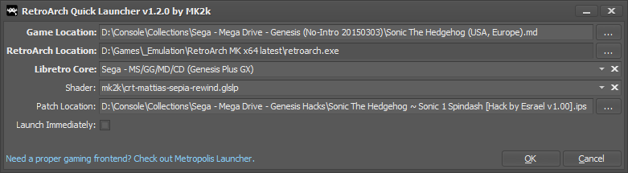

# RetroArch Quick Launcher

**RetroArch Quick Launcher** is a small Windows application which allows you to quickly launch [RetroArch](https://retroarch.com/) with a chosen Libretro core and optional shader and/or patch file for a given ROM file.

If you choose **RetroArch Quick Launcher** as the default application for your ROM files, you'll see its dialog after double clicking your ROM file and by the press of the **OK** button or simply pressing **ENTER**, RetroArch is launched.

## Installation

Download the latest release from the [Releases section](https://github.com/theMK2k/retroarch-quick-launcher/releases), unpack and enjoy!

## Features / Usage

- Game Location (the ROM file):
  - run **RetroArch Quick Launcher** with the ROM file as command line parameter
  - let **RetroArch Quick Launcher** be the default application for the ROM file and double click or press **ENTER** on the file in Explorer
  - drag/drop the ROM file in the text box
  - use the browse button 

- RetroArch Location:
  - **RetroArch Quick Launcher** stores the RetroArch location, so you only need to provide it once
  - drag/drop retroarch.exe in the text box
  - use the browse button 

- Libretro Core:
  - **RetroArch Quick Launcher** stores the selected core per ROM file type, so you only need to select it once per platform
  - use the dropdown list and select the Libretro core you want to use for your ROM file

- Shader (optional):
  - **RetroArch Quick Launcher** stores the selected shader per ROM file type, so you only need to select it once per platform
  - use the dropdown list and select the shader of your choice

- Patch Location (optional):
  - Supported patch file formats: `.ips`, `.ups` and `.bps`
  - run **RetroArch Quick Launcher** with the patch file as another command line parameter
  - drag/drop the patch file in the text box
  - use the browse button 
